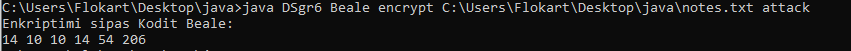
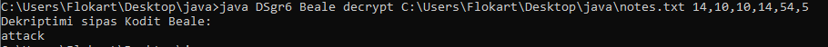
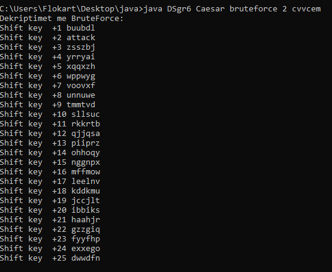
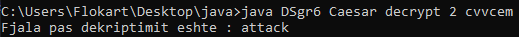
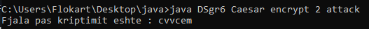
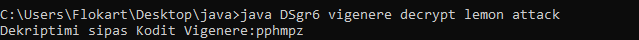
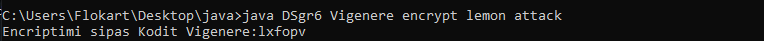

# DS_GR6

-Komanda Vigenere: Eshte metode enkriptuese polialfabetike e cila kryen enkriptimin duke pranuar dy parametra mesazhin qe deshirojme ta enkriptojme dhe celesin e enkriptimit, me ane te ketyre dy parametrave enkripton mesazhin permes formulave perkatese. Logjika per fitimin e karakterit te enkriptuar eshte bere duke gjetur distancen mes dy shkronjave: keyWord.chatAt(i-c)-'A' dhe pastaj kjo diference t'i shtohet 
plaintext.charAt(i) , kur rezultati eshte me i madh se 'Z' perdorim logjiken e modulos, hapat e njejte (me pershtatje) kalohen edhe kur 
mesazhi permbane shkronja te vogla. Dekriptimi behet me logjike te njejte por me zbritje e jo mbledhje, shihet ne kod.
Shkrimi adekuat i argumenteve per thirrjen e kesaj metode eshte: ds Vigenere encrypt <celesi> <plaintext>
                                                            ose: ds Vigenere decrypt <celesi> <ciphertext>

-Komanda Beale :
encrypt(String path, String encryptWord):
Eshte metode e cila kryen enkriptimin duke perdorur dy parametra hyres te cilet jane shtegun se ku ndodhet libri qe deshirojm te enkriptojme prej tij: String path dhe fjalen te cilen deshirojme ta enkriptojme: String encryptWord. Si fillim e kemi shkruajtur kodin qe na lejon te lexojm path-in i cili nese nuk mundet me gjet dokumentin e kthen nje error Couldn't find the file.Dokumentin qe e lexon e kthen ne shkronja te vogla qe me qene me e sakte. Krijojme nje for loop ku i = 0 deri sa eshte gjatesia e encryptWord ku per secilen shkronje te encryptWord do te veproje si ne vijim. Do te krijohen dy numerues ( count, t ) te barabarte me zero.
Komanda : “for (String st : s.split("\\s+"))” bene ndarjen e fjaleve brenda dokumentit dhe per secilen fjale count do te rritet per nje.String ch eshte encryptWord.charAt(i) i konvertuar ne string dhe nese ky karakter eshte numer ateher ai do te injorohet ose do te 
kthehet si space.Kemi thene se nese st fillon me ch ateher te nderpritet kerkimi perndryshe te rritet t per nje. Komanda if (t < count) eshte komande e cila kthen karakteret te cilat e permbushin kushtin se ato ndodhen brenda librit. 
decrypt(String path, String decryptWord):
Ngjashem si metoda e enkriptimit eshte realizua edhe kjo e dekriptimit e cila e merr path dhe 
decryptWord. DecryptWord e ndajme ne pjes permes space ku secilen pjese e shikojm a jane numra
permes metodes boolean isNumeric nese nuk eshte numer ateher ate pjese nuk e deshifrojme dhe 
vazhdojm te deshifrojm pjeset e tjera ku merr karakterni e pare qe gjendet te fjala me ate 
numer.
Referencat: Metoden isNumeric https://www.baeldung.com/java-check-string-number

-Komanda Caesar :
encrypt(String plaintext, int Key):
Eshte metode e cila kryen enkriptimin duke perdorur dy parametra hyres te cilet jane 
plaintext-i dhe Key numri per te cilin zvendoset secila shkronje e plaintext-it. Kemi marr 
nje for loop e cila shkon neper secilen shkronje te plaintext-it dhe e shikon nese eshte shkonje
e madhe, e vogel ose space. Nese shkronja eshte e madhe perdoret formula :
'A' + ((int) plaintext.charAt(i) - 'A' + Key) % 26,
nese shkronja eshte e vogel perdoret formula :
'a' + ((int) plaintext.charAt(i) - 'a' + Key) % 26,
ndersa nese eshte space ateher vetem pershkruhet.
Ngjashem me enkriptimin krijohet edhe ajo e dekriptimit vetem se formules nuk i shtohet qelsi po
i heket ai gjithashtu i shtohet edhe numri 26 per shkak qe te del vlera pozitive.
Gjithashtu edhe bruteForce eshte e ngjashme me metoden enkript vetem ktu Key merr vlera prej 1 deri ne 25.
Referencat:https://www.w3schools.com/ https://www.geeksforgeeks.org/java/, Libri :Introduction to Java programming

Shembujt jane ne vazhdim:

FAZA 2 dhe 3:

-Komanda CreateUser
Shkrimi adekuat i argumenteve per thirrjen e kesaj metode eshte: ds create-user <emri> 
Tek emri shkruhet emri i userit celesat e te cilit deshirojme t'i krijojme, kujdes pranon vetem karaktere 0-9 a-z A-Z apo underline. Pas shkrimit te emrit kerkohet shkrimi i password-it i cili behet pa echo te simboleve ne ekran. Me pas ruhen ato te dhena te shfrytezuesit te krijuar ne databaze.

-Komanda DeleteUser
Shkrimi adekuat i argumenteve per thirrjen e kesaj metode eshte: ds delete-user <emri> 
Tek emri shkruhet emri i userit celesat e te cilit deshirojme t'i fshijme, kujdes nese ata celesa(njeri celes) ekzistojne emrin mund ta kene vetem me karakteret: 0-9 a-z A-Z apo underline. Me kete rast fshihen edhe te gjitha te dhenat ekzistuese te atij user-i ne databaze. 
  
-Komanda ExportKey
Shkrimi adekuat i argumenteve per thirrjen e kesaj metode eshte: ds export-key  <public|private> <emri> [file]
Tek emri shkruhet emri i userit celesin e te cilit deshirojme ta perdorim, kujdes pranon vetem karaktere 0-9 a-z A-Z apo underline.
Ne file shkruajme file ku deshirojme ta export-ojme ate celes.
  
-Komanda ImportKey
Shkrimi adekuat i argumenteve per thirrjen e kesaj metode eshte: ds import-key <emri> <path>
Ne file shkruajme file ku deshirojme ta ruajme ate celes.
 
-Komanda Login
Shkrimi adekuat i argumenteve per thirrjen e kesaj metode eshte: ds login <emri> 
Kjo komand e mundeson qe kur te logohet te krijohet nje token ne folderin Tokens/ qe skadon pas 20 minutave.

-Komanda Status 
Shkrimi adekuat i argumenteve per thirrjen e kesaj metode eshte: ds status <token> 
Kjo komande e shikon se a eshte valid tokeni i krijuar apo jo.
  
-Komanda WriteMessage
Shkrimi adekuat i argumenteve per thirrjen e kesaj metode eshte: ds write-message <emri> <mesazhi>
                                                            ose: ds write-message <emri> <mesazhi> <file>
Tek emri shkruhet emri i userit celesin e te cilit deshirojme ta perdorim, kujdes pranon vetem karaktere 0-9 a-z A-Z apo underline.
Nese thirrim opsionin e pare mesazhi shfaqet ne command line me println, kurse nese thirrim opsionin e dyte mesazhi ruhet ne file-in e dhene .txt 

-Komanda ReadMessage
Shkrimi adekuat i argumenteve per thirrjen e kesaj metode eshte: ds read-message <mesazhi i enkriptuar>
                                                            ose: ds read-message <txt file ne te cilin eshte ruajtur mesazhi i enkriptuar>
Referencat e perbashketa:
www.howtodoinjava.com ,  www.stackoverflow.com , www.programcreek.com , www.geeksforgeeks.com , https://metamug.com/article/security/jwt-java-tutorial-create-verify.html, https://developer.okta.com/blog/2018/10/31/jwts-with-java, Libri :Introduction to Java programming
